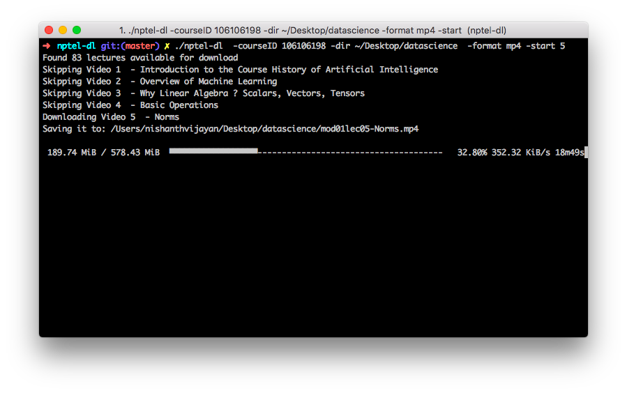

# nptel-dl

A command line tool to download course videos from NPTEL



## Features

- Download course to user requested path (option: `-dir`).
- Support downloading in MP4, FLV & 3GP file formats (option: `-format`)
- Start download from a specific lecture number (option: `-start`)

## Download

You can download the binaries for your machine from the [releases page](https://github.com/nishanthvijayan/nptel-dl/releases).

## Usage
### Help
```
nptel-dl -h
```
### Download course
```
nptel-dl -courseID 106106198
```

### Download course to specific directory
```
nptel-dl -courseID 106106198 -dir ~/Desktop/myawsomecourses/machine-learning
```


### Start download from a specific lecture number
```
nptel-dl -courseID 106106198 -start 21
```

### Download different formats
```
nptel-dl -courseID 106106198 -format 3gp
```
Currently supported format options are: mp4, 3gp & flv.  
Default format is MP4  


## TODO:
- Add mp3 download support (option: `-format mp3`)
- Add PDF Transcript download support (option: `-transcript`)
- Add info option that list all videos (option: `-info`)
- Add option to download a specific module (option: `-module`)
- Add option to download till a specific lecture number (option: `-end`)
- Support for resumable downloads
